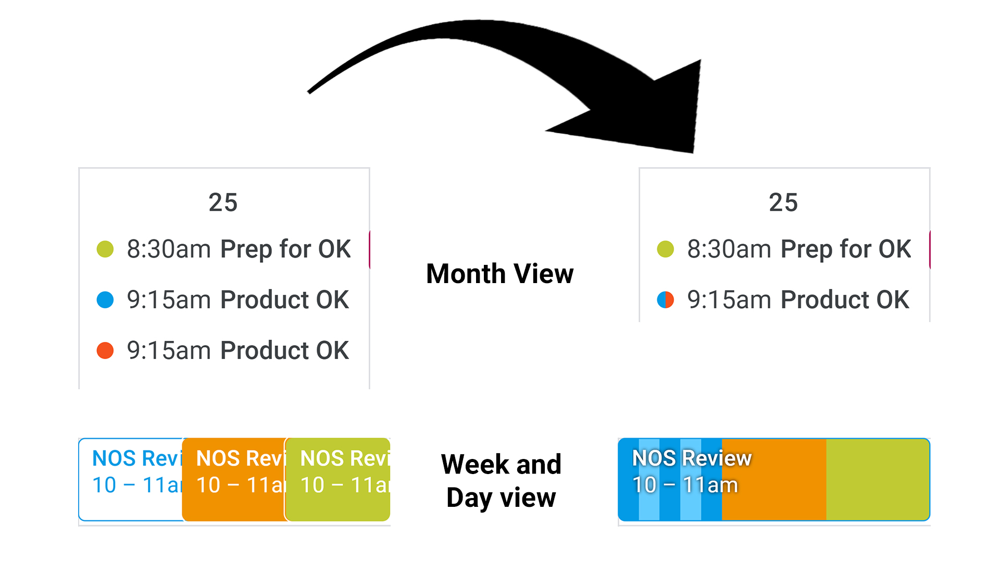

Google Multi-Calendar Event Merge
=========================

Chrome extension that visually merges the same event on multiple Google Calendars into one event.

Forked from [@imightbeamy's repo](https://github.com/imightbeamy/gcal-multical-event-merge)

# Download
## [for Chrome](https://chrome.google.com/webstore/detail/cal-merge-for-google-cale/dchpdbljalbfnelbfbgncfidhjoibkah)
## [install with Greasemonkey](https://github.com/hcawn/gcal-multical-event-merge/raw/master/events.user.js)

### Usage

- Add extension to browser
- Refresh Google calendar webpage
- Press extension icon to see settings
	- Toggle enabled status
	- Toggle old candycane styling vs new

### Build

Run `build` or `build_windows` to create zip file for Chrome and FF.